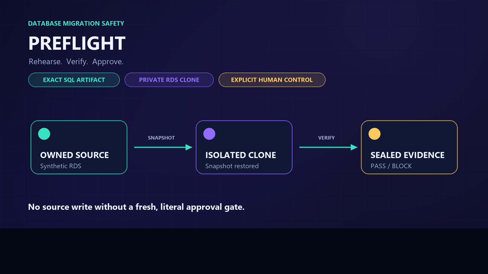
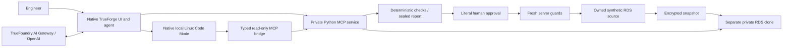

# Preflight

**Rehearse a database migration. Verify what changed. Approve the exact SQL.**

Preflight is a working PostgreSQL migration rehearsal agent built on **TrueForge, an OpenAI model through TrueFoundry AI Gateway, Python MCP, and AWS RDS**. It restores a separate private clone from a snapshot, rehearses an immutable SQL candidate, checks schema and protected values, and presents evidence before a human can authorize the source transaction.

A migration can execute successfully and still change the wrong data. Preflight checks the intended result, not just whether PostgreSQL accepted the statement.

[](demo/Preflight-Demo.mp4)

**[Watch / download the demo](demo/Preflight-Demo.mp4)** — **2:58**, 1920×1080 MP4, captions, including 40 continuous seconds of actual TrueForge use. Source Deny/Allow and cleanup are shown as historical receipts; the migration was not reapplied for filming. [Video verification and SHA-256](docs/audit/video-verification.json).

## What was demonstrated

The connected demonstration used one owned synthetic RDS source and one separate snapshot-restored private clone. These are recorded results, not claims about arbitrary production databases or current infrastructure state.

| Step | Observed result | Evidence |
|---|---|---|
| Bad migration | A 68-byte candidate failed with SQLSTATE `23502`, rolled back, preserved the baseline and received **BLOCK** | [BLOCK report](evidence/connected/final-aws-bad-report.md) · [JSON](evidence/connected/final-aws-bad-report.json) |
| Corrected migration | A new 183-byte artifact committed on the clone and passed **18 mandatory checks**, including preservation and intended-change coverage | [PASS report](evidence/connected/final-aws-good-report.md) · [JSON](evidence/connected/final-aws-good-report.json) |
| Human Deny | The operator denied the first source request; the source remained unchanged | [Final proof](evidence/connected/source-and-cleanup-proof.json) |
| Human Allow | A fresh approved request passed the locked precheck and committed once in **130 ms**; source: **1,000 rows, four columns, zero intended-value violations** | [Final proof](evidence/connected/source-and-cleanup-proof.json) |
| Replay protection | A later approved request was refused with `SOURCE_APPLY_REPLAY_REJECTED` before SQL ran; no automatic retry | [Final proof](evidence/connected/source-and-cleanup-proof.json) |
| Separate cleanup approval | The run-owned clone was observed **ABSENT**; the encrypted recovery snapshot remained **AVAILABLE**; state `RETAINED_RECOVERY` | [Final proof](evidence/connected/source-and-cleanup-proof.json) |
| Native sandbox | Connected Linux Code Mode execution and bounded filesystem, process, network, socket and timeout canaries passed | [Canaries](evidence/connected/local-sandbox-canaries.json) · [Agent execution](evidence/connected/saved-agent-code-mode.json) |

Run: `7f1a627e-a6d0-4c9f-a5ce-58984b38d41e`. Final resource observation: **2026-09-26, 11:51:42 UTC**. Source and host were retained; clone cleanup does not mean all AWS resources were deleted.

The full local gate recorded **668 passed, zero failures/errors/skips**, in 248.38 seconds at revision `5c2a56d`. It used actual disposable PostgreSQL 18.6/TLS and local MCP; AWS client tests used boto Stubber. Local tests are separate from the connected RDS proof above. [Commands, revisions and results](docs/audit/local-sandbox-verification.json).

## How it works



The bundled TrueForge interface is the product surface: chat, tool traces and approval panels. The Python service owns SQL policy, credentials, resource ownership, transactions, evidence and write guards. The model explains results; it cannot redefine a verdict or supply human approval.

The demonstrated configuration uses **TrueForge's native local Linux sandbox**, following operator amendment D26. Daytona is not required. Under amendment D25, the observed Gateway route was `openai/gpt-model`, alias `vm-polaris/openai`, with observed upstream `gpt-4o-mini-2024-07-18`. This runtime uses the configured Gateway credential, not ChatGPT subscription authentication.

### What makes the result trustworthy

- **Exact bytes:** immutable candidates bind SQL and contract hashes. A revision creates a new candidate.
- **Complete checks:** PASS requires every mandatory check and supported preservation/intended-change coverage for every written column. Row counts alone are insufficient.
- **Historical evidence versus current permission:** a sealed PASS describes the clone rehearsal; fresh source checks and literal approval still control source apply.
- **Two human gates:** `apply_to_demo_source` and `cleanup_run` remain separate. A chat message is not an approval event.
- **No blind retries:** unknown commit outcome is not rollback; successful application cannot be replayed automatically.
- **Scoped access:** one allowlisted synthetic source, owned run resources and private service endpoints. Credentials and raw rows stay out of prompts, reports and the sandbox.
- **Independent review:** [T27 connected boundary review](docs/audit/T27_CONNECTED_BOUNDARY_REVIEW.md) was accepted before the live source demonstration.

## Verify the evidence yourself

Requires Python 3.12 and `uv`. Install the locked environment:

```bash
uv sync --locked
```

Verify the actual connected PASS report against the retained expected digest:

```bash
uv run preflight evidence verify evidence/connected/final-aws-good-report.json --expected-report-sha256 6e069069851c9af3a2f1c021a9afb9ba43ba24f586c27556faa78e3cdda562ab
```

Verify the connected BLOCK report:

```bash
uv run preflight evidence verify evidence/connected/final-aws-bad-report.json --expected-report-sha256 c6332b9c508fcab0dd228f5d225654fe939575511f41e87561d492b8c0e82a61
```

These checks need no AWS credentials. The verifier checks canonical payload hashing, schema versions, requirement completeness, aggregate evidence and the recomputed verdict. An expected digest from this same repository establishes consistency with this published copy; independent trust requires a digest retained separately. Without an anchor it reports `SELF_CONSISTENT_UNANCHORED`. Neither mode establishes current source eligibility.

## Run locally

Tested stack: Python 3.12, PostgreSQL 18, Node 24.11.1, MCP 2.2.0 and pinned `@truefoundry/trueforge@0.2.1`.

```bash
uv sync --locked
npm ci --prefix integration --ignore-scripts --no-audit --no-fund
```

Create an ignored settings file from the nonsecret, fail-closed example:

```powershell
Copy-Item config/settings.example.json config/settings.local.json
uv run preflight doctor --json
```

Use authorized private resource references and the documented secret-store setup. Copying the example does not provision infrastructure or enable source writes. The native sandbox runtime requires Linux; the connected demo ran on Linux EC2. Follow [deployment instructions](integration/DEPLOYMENT.md) and [the demo runbook](integration/DEMO_RUNBOOK.md) for the private TrueForge/Gateway/MCP setup and rehearsal sequence.

Prepare exact candidate bytes and start the configured loopback service:

```powershell
New-Item -ItemType Directory -Force var | Out-Null
uv run preflight candidate intake --sql fixtures/good.sql --contract config/contract.example.json --output var/good-candidate.json --operator-id team-operator
uv run preflight serve
```

For the full local test gate, install PostgreSQL 18 binaries and initialize a disposable TLS fixture. The fixture refuses to replace an existing cluster:

```powershell
uv run python fixtures/local_pg.py --bin C:/path/to/pgsql/bin --port 55438
$env:PREFLIGHT_TEST_PG_PORT='55438'
$env:PREFLIGHT_TEST_PG_CA=(Join-Path (Get-Location) 'var/local-postgres/data/server.crt')
uv run preflight verify local
```

Stop it explicitly with `C:/path/to/pgsql/bin/pg_ctl -D var/local-postgres/data stop`. This is a local test backend, not RDS evidence. Additional checks:

```bash
uv run ruff check src scripts tests infra
uv run mypy src/preflight
uv build --no-sources
uv run python scripts/verify_distribution.py
```

## Full walkthrough script — 2:58

The video uses burned-in captions rather than spoken narration. This complete presenter script follows its timed sections. Historical approvals are shown as receipts; no gate is clicked or migration reapplied during filming.

### 0:00–0:15

**On screen:** Title, one-line architecture, then the saved `preflight` TrueForge agent

“A database migration can execute successfully and still change the wrong data. Preflight rehearses the exact SQL artifact on a private snapshot-restored RDS clone, verifies the result deterministically, and keeps the owned synthetic source behind explicit approval.”

### 0:15–0:55

**On screen:** **Live native TrueForge UI.** The edited excerpt sends one read-only `get_run` request for run `7f1a627e-a6d0-4c9f-a5ce-58984b38d41e`, request `30366339-0a39-4a74-9c81-a4a1cd9eb380`. It shows `APPLIED`, cleanup `RETAINED_RECOVERY`, and another source apply ineligible. No `get_report` or Code Mode execution occurs in this excerpt.

“This is the saved TrueForge product agent on the verified Gateway route. The edited live excerpt makes one read-only run-status request. Bounded isolation canaries passed during prior connected verification. Here the service reports source APPLIED, recovery retained, and another apply ineligible. The service owns those facts; the model explains them, but it cannot redefine PASS, BLOCK or approval.”

### 0:55–1:25

**On screen:** Evidence card summarizing the recorded bad transaction/BLOCK report and corrected transaction/PASS report.

“Here is the completed connected rehearsal on the disposable clone. The 68-byte bad candidate rolled back with SQLSTATE 23502; the baseline stayed unchanged and the sealed verdict was BLOCK. A separately registered 183-byte corrected artifact committed. All 18 mandatory checks passed, including complete preservation and intended-change coverage. Its trusted report digest begins 6e0690.”

### 1:25–1:55

**On screen:** Recorded TrueForge source gate: Deny event and no-change verification, then the later fresh Allow request and APPLIED receipt

“These are historical human decisions captured in TrueForge. The first source request was denied, and the read-only check confirmed 1,000 rows and three columns: no source change. A later fresh request targeted the same reviewed candidate and report. After Allow, fresh server guards matched and the transaction committed once in 130 milliseconds. The source then had 1,000 rows, four columns, and zero intended-value violations.”

### 1:55–2:20

**On screen:** Recorded fresh replay request and its refusal

“Approval is not a reusable token. A new approved request tried to repeat the same source apply. Before SQL ran, the service returned SOURCE_APPLY_REPLAY_REJECTED, marked it non-retryable, and preserved the already applied state. Unknown outcomes are also never retried automatically.”

### 2:20–2:43

**On screen:** Recorded cleanup gate and final AWS observation

“Cleanup has its own human gate. The approved action deleted only the run-owned clone and explicitly retained the pre-apply recovery snapshot. The final AWS observation found the clone absent and the encrypted, run-tagged snapshot available. The source and host remain active; this is deliberate clone-only cleanup, not broad teardown.”

### 2:43–2:58

**On screen:** Final proof card: source APPLIED, replay refused, clone ABSENT, snapshot AVAILABLE, local regression result

“The source is APPLIED, replay is refused, the clone is absent, and recovery evidence is retained. The local gate also passed 668 tests with no failures, errors or skips. This proves the recorded owned-synthetic run; it does not claim every environment or every remaining adversarial scenario.”


## Repository guide

| Path | Purpose |
|---|---|
| [src/preflight/](src/preflight/) | Python MCP service, SQL policy, transactions, state, RDS orchestration, checks and offline verification |
| [tests/](tests/) | Unit, PostgreSQL, MCP, AWS client and TrueForge integration tests |
| [fixtures/](fixtures/) | Exact SQL examples and disposable synthetic database fixtures |
| [integration/](integration/) | Pinned TrueForge package, deployment instructions and demo runbook |
| [infra/](infra/) | Private runtime bootstrap, scoped IAM templates and operations |
| [evidence/connected/](evidence/connected/) | Sanitized connected evidence; older failures remain as historical records |
| [Safety contracts](docs/02_CONTRACTS_AND_SAFETY.md) | Tool semantics, transaction and evidence requirements |
| [Decisions](docs/00_PRODUCT_AND_DECISIONS.md) | Original decisions and researched operator amendments |
| [Build ledger](docs/09_BUILD_STATUS.md) | Chronological history; current dated entries supersede historical checkpoints |
| [Original PRD](reference/Preflight-PRD.md) | Original brief, preserved byte-for-byte |

Start with this README and the final proof links when assessing the submission. Planning documents and audit snapshots preserve development history; they are not all current readiness statements. Contract and integration documents remain included because they support reproducibility.

## Scope and remaining work

The owned-synthetic end-to-end path described above and the video are complete. Additional adversarial runtime evaluation cases and organizer-specific submission fields are not claimed complete; see the [continuation report](docs/audit/LOCAL_SANDBOX_CONTINUATION_REPORT.md) for recorded scope. The video combines title/evidence cards, actual screen excerpts and reading holds; it is not an uninterrupted recording of AWS restore latency.

Preflight supports a bounded PostgreSQL grammar, type set, object policy and scan budget. It assumes a controlled synthetic source and private runtime. It is not a general production migration engine, zero-downtime guarantee, universal sandbox-containment proof, or automatic rollback system. A retained pre-apply snapshot supports recovery planning; it does not make a successful migration automatically reversible.

Secrets, configured operator files, keys, state databases, raw logs, worktrees, local draft notes and recording intermediates are excluded from Git. Only the reviewed final demo and selected sanitized evidence are published.

## Dependencies and licensing

See the [locked dependency inventory](integration/dependency-inventory.json) and [third-party notices](integration/THIRD_PARTY_NOTICES.md). In particular, `pglast 8.4` declares `GPL-3.0-or-later`. The project's own license is currently **UNDECIDED**; public visibility does not grant a separate project license.
