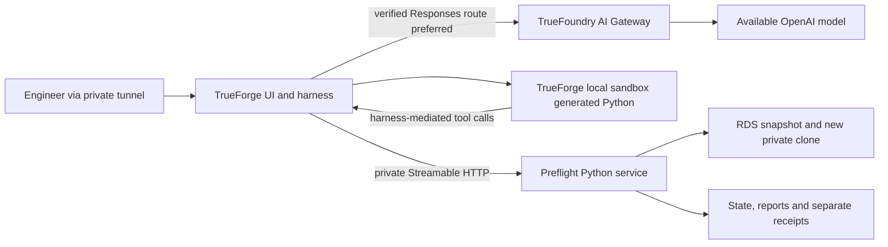

# 01 — Architecture and implementation boundaries

Read [product decisions](00_PRODUCT_AND_DECISIONS.md) first. Public API semantics live in [02](02_CONTRACTS_AND_SAFETY.md); do not redefine them here.


## Model route and evidence boundary (V3 Sol-first)



Gateway is for model traffic; it is **not** a reason to publish the private Preflight MCP endpoint or RDS. Provider API keys stay in TrueForge/Gateway configuration; AWS identity and DB secrets stay in the service's existing role/Secrets Manager boundary. The preferred path is a design to validate, not an already deployed integration.

Record three distinct model identifiers: the ordinary coding model (`gpt-6-sol`/`gpt-5.6-sol`; exceptional Astra reviews are logged separately), the Gateway's upstream model ID from its Playground, and the saved TrueForge model resource name. They are not interchangeable strings. The actual API family, adapter, resolved model and permitted reasoning options are saved in the compatibility record.

A sanitized trace record links `run_id`, `candidate_id`, immutable report digest, TrueForge session/turn, TrueForge local sandbox execution, MCP request/attempt and observed AWS/model request IDs. Fields absent from the real provider are null/NOT_OBSERVED. Store supplemental traces separately from sealed reports when obtained later. Correlation is not cryptographic proof of human approval; the original controlled-demo limitation remains.

## Deployment shape

```text
Engineer browser
  -> SSH forwarded localhost:8790
     -> TrueForge UI + agent loop + human approvals [EC2]
        -> OpenAI HTTPS [migration + redacted evidence only]
        -> TrueForge local sandbox [generated Python; no AWS/DB credential]
           -> TrueForge Code Mode MCP bridge
              -> http://127.0.0.1:8000/mcp [same EC2 host]
                 -> Preflight Python service
                    -> SQLite + immutable report files [persistent volume]
                    -> AWS RDS / Secrets Manager [EC2 instance profile]
                    -> PostgreSQL source [private; read normally]
                    -> PostgreSQL rehearsal clone [private; migration writes]

Source RDS instance -> RDS snapshot -> separate clone instance
Source migration write -> only approved apply_to_demo_source + current guards
```

The source and clone are in the team's AWS VPC. The service host may have a controlled SSH entry point and outbound HTTPS, but **8790 and 8000 are never public**. Only its security group can reach the database groups on 5432. TrueForge local sandbox does not connect to RDS. Both RDS instances are private. TrueForge and Preflight use different SQLite databases and separate state directories.

The MCP endpoint uses Streamable HTTP, not a hand-built REST substitute. The MCP process is the trusted boundary for credentials, table access, SQL policy, verdicts and writes. Tool inputs contain IDs, not user-supplied hosts, DSNs or arbitrary URLs. Source/clone endpoints are resolved and verified through the allowlisted AWS resources.

## Target repository tree — implement during the event

```text
preflight/
  AGENTS.md, START_HERE.md, CLAUDE.md, docs/, reference/  # this kit
  pyproject.toml, uv.lock, .python-version
  src/preflight/
    __init__.py
    models.py                 # typed contracts, errors, domain records
    config.py                 # validated environment and operator policy
    server.py                 # thin MCP tools, transport, middleware
    service.py                # use cases, locks, guards, orchestration
    storage.py                # SQLite repositories, CAS transitions, events
    artifacts.py              # exact bytes, canonical JSON, immutable files
    sql_policy.py             # AST grammar and object-capability policy
    db.py                     # TLS sessions, transaction runner, deadlines
    evidence.py               # schema normalization, row digests, typed checks
    verdict.py                # pure deterministic classification
    report.py                 # report payload + concise Markdown rendering
    security.py               # IDs, artifact/target/state guards, safe errors
    aws_rds.py                # thin Boto3 snapshot/restore/tag operations
    jobs.py                   # durable cloud worker/reconciliation only
    cli.py                    # doctor, intake, local verification, evidence export
  fixtures/
    seed_demo.py
    bad.sql, good.sql, wrong_data.sql
    contract.json
  config/
    operator-inputs.example.json
    operator-inputs.local.json # ignored
    contract.example.json
    trueforge-agent.example.json
    trueforge-agent.local.json # ignored; actual configured model
  infra/
    bootstrap.py              # plan/apply with explicit account/spend guard
    permissions.md            # tested policy scope and bootstrap/runtime split
    systemd/                  # unit files for installed services
  tests/
    unit/, postgres/, mcp/, cloud/, trueforge/
    conftest.py
  evidence/                   # untracked full evidence, sanitized selected export
  var/                        # ignored SQLite, SQL artifacts, reports, job locks
  README.md                   # implementation/setup/demo/AI disclosure
```

Do not create all modules with placeholder `pass` and call that progress. Create shared interfaces early, then deliver vertically working tasks. No business logic belongs in the tool decorators. No worker changes a second worker's modules without an agreed handoff.

## Ownership and dependency direction

| Owner | Writes | Consumes |
|---|---|---|
| Lead | models, config, service, storage, artifacts, security, verdict, server, cli, dependency locks; task ledger | Database and AWS adapters through frozen interfaces |
| Database worker | sql_policy, db, evidence, fixtures, DB/policy/evidence tests | Typed models/config; injected connections and clock |
| Cloud worker | aws_rds, jobs, infra, cloud tests | Store/job interfaces; approved operator policy |
| Integration worker | report rendering, TrueForge configuration/integration tests, evidence packaging, implementation README/demo material | Public MCP schemas and immutable evidence models |
| Read-only reviewer | Findings only, handed to the owning lane | Changed code, tests, state transitions, real traces |

Dependency direction: `models/config` -> adapters/pure functions -> `service` -> `server/cli`. Report rendering must not import cloud/DB write code. `verdict` must not depend on an LLM. `jobs` never invents a source apply operation. An apply coordinator may be in `service`, but never in the automatic cloud job loop.

## Shared interfaces to freeze before parallel implementation

Names below are **project-defined interfaces**, not claims about an upstream SDK. The lead implements the domain types and freezes these signatures, including sync/async behavior, in T02. Prefer synchronous DB/Boto3 adapters called through a bounded worker executor; keep the MCP event loop responsive. SQLite access uses one connection per thread/operation, never a shared cross-thread cursor.

| Interface | Required behavior |
|---|---|
| `CandidateStore.register(input) -> Candidate` | Validated bytes/hashes/contract; optional atomic revision attachment |
| `RunStore.transition(run_id, expected_state, new_state, event) -> Run` | Compare-and-swap; durable event; refuses concurrent/illegal transitions |
| `ArtifactStore.write_once(path, bytes) -> sha256` | Safe run-owned path, exclusive immutable write, fsync/atomic rename; no overwrite |
| `SqlPolicy.inspect(sql_bytes, contract) -> SqlPlan` | Supported AST and touched/read/mutated columns; no execution; safe diagnostics |
| `DbEvidence.capture(connection, contract, budget) -> EvidenceBundle` | Consistent schema/PK/preserved/full-existing digests; in-memory private maps |
| `MigrationRunner.execute(connection, sql_bytes, plan, limits, checks_before_commit) -> TxOutcome` | Exact script, deadlines, rollback/commit/unknown classification; result sets drained |
| `EvidenceComparator.compare(before, after, contract) -> CheckSet` | PK changes, preserved changes, expected schema, typed checks; complete coverage |
| `Verdict.evaluate(checks, operation_outcome, coverage) -> VerdictResult` | BLOCK beats WARN beats PASS; no model judgement |
| `RdsAdapter.snapshot/restore/describe/tags/delete(...)` | Explicit account/IDs/tags and private network; safely sanitized SDK failures |
| `RehearsalService.<tool_use_case>(input) -> ToolEnvelope` | One source of state/guard rules consumed by MCP and local tests |
| `ReportRenderer.render(payload) -> markdown` | Deterministic layout; no DB/API calls, no hidden mutable fields |

`EvidenceBundle` has a private in-memory section that must not be serialized by a model library's default `model_dump`. Public evidence uses a separately defined type. Write tests that attempt that accidental serialization.

## Persistence design

Use SQLite WAL with foreign keys, explicit transactions and bounded busy timeout. Persist on an EBS-backed directory owned by a dedicated OS user with restrictive permissions. Run one Preflight service process; prevent multiple writers with a process lock plus DB concurrency guards. Thread locks alone are not durable coordination.

| Record | Required fields / constraints |
|---|---|
| `candidates` | UUID candidate ID; parent ID; operator label; SQL SHA-256; canonical contract SHA-256; raw-contract SHA-256; byte sizes; artifact paths; creation time; policy version; immutable after registration |
| `runs` | UUID run ID; current candidate; account/region/source/DB; snapshot/clone IDs and ARNs; phase; baseline/schema/full/preserved digests; policy/engine versions; timestamps; last safe error; current eligibility; resource lifecycle; state revision |
| `jobs` | Job type; deterministic AWS resource ID; desired operation; attempt counter; last poll; next poll; deadline; lease owner/expiry; AWS request ID when returned |
| `events` | Monotonic event ID; UTC timestamp; run/candidate; before/after state; action; safe result code; correlation ID; **no SQL values or rows** |
| `reports` | Run/candidate unique sealed report; payload schema version; payload SHA-256; JSON/Markdown paths; evidence coverage; created time; immutable |
| `apply_attempts` | Unique committed-or-uncertain source attempt per run; expected hashes; target; intent time; state; precheck result; commit acknowledgement flag; confirmation result; no source password |
| `receipts` | Immutable later apply/cleanup observations; linked report SHA-256; prior event ID; actual observed result; outcome uncertainty explicit |
| `idempotency` | Request ID + operation + canonical input digest; first result/reference; expiry policy; changed input with same ID rejected |

Artifacts: `var/artifacts/<candidate_id>/migration.sql` stores original bytes; `contract.input.json` original contract bytes when supplied through local intake, and `contract.canonical.json` canonical accepted contract. Tool-only JSON input has a canonical hash and no claimed original file hash. Use run UUIDs, not arbitrary paths supplied by an agent.

Reports: `var/reports/<run_id>/<candidate_id>.json` and `.md`; receipts alongside them under unique receipt IDs. Do not put per-row maps or raw primary keys in SQLite, reports or logs. Only aggregate digests/counts are persistent. Keep per-row maps in bounded memory until comparison is sealed; lost maps cause an incomplete run, not fabricated mismatch counts.

The event journal is useful audit evidence, **not** a cryptographically tamper-proof enterprise ledger. SQL/report hashes establish artifact identity; they do not prove who approved or prevent a root user modifying all state.

## State machine

Run phase, verdict and resource cleanup are different fields. A candidate without a run has no run phase. Normal flow:

```text
REGISTERED -> SNAPSHOTTING -> RESTORING -> READY -> BASELINED
BASELINED -> MIGRATING
MIGRATING -> VALIDATING          [clone commit confirmed]
MIGRATING -> BLOCKED             [clone rollback confirmed; error recorded]
MIGRATING -> CLONE_OUTCOME_UNKNOWN [outcome not established; never replay]
VALIDATING -> PASS -> AWAITING_APPROVAL [complete PASS report sealed]
VALIDATING -> WARN               [incomplete evidence]
VALIDATING -> BLOCKED            [required check failed]
AWAITING_APPROVAL -> APPLYING    [tool actually allowed; guards accepted]
APPLYING -> APPLIED              [commit and confirmation known]
APPLYING -> APPLY_FAILED         [rollback confirmed]
APPLYING -> APPLIED_NEEDS_ATTENTION [commit known; post-commit check uncertain/failed]
APPLYING -> APPLY_OUTCOME_UNKNOWN [commit outcome unknown]
AWAITING_APPROVAL -> STALE       [source drift observed; new rehearsal required]
```

Emit PASS then AWAITING_APPROVAL events atomically after report sealing; the external final phase is AWAITING_APPROVAL and the report verdict is PASS. **A denied tool never reaches Preflight**, so denial produces no service transition and no write connection. TrueForge's trace is the denial evidence.

A rolled-back BLOCKED run may attach a revised candidate and return to BASELINED only with the same canonical contract hash and fresh equality of the original schema **and full pre-existing data**, no successful intervening mutation, no unknown outcome, and no prior source apply. Other BLOCKED/WARN/STALE/unknown outcomes need a new run; do not resurrect them by toggling an enum.

Snapshot/restore/readiness failures become ERROR with operation-specific codes and retained resource IDs. A safety refusal due to an invalid request normally leaves phase unchanged and appends a refusal event. A verified source drift changes the run to STALE. Incomplete validation is WARN, not an exception converted to an empty PASS.

Cleanup uses an orthogonal `cleanup_state`: NOT_REQUESTED / DELETING_CLONE / CLONE_DELETED / DELETING_SNAPSHOT / RETAINED_RECOVERY / COMPLETE / CLEANUP_ERROR. Historical report/verdict/apply outcome survives cleanup. Once the clone is deleted, current apply eligibility is false, even if a previous report was PASS.

## Asynchronous work and restarts

`start_rehearsal` commits intent and returns promptly. A bounded worker starts snapshot creation, observes availability, starts restore, observes availability and verifies identity/network. Poll with exponential backoff and jitter; show elapsed seconds and last AWS status, not a fabricated percentage or completion time. Infrastructure deadlines are operator-configured. One active run and the configured resource-count caps are enforced transactionally.

Deterministic resource names use a validated short lowercase run suffix; store full run UUID in tags. On a create timeout, describe the exact expected name and verify ownership before trying again. Never generate a new name on every retry. On restart, reconcile snapshots/clones by persisted IDs/tags. A collision with wrong tags is an error, not permission to adopt/delete it.

For interruption during baseline/validation, discard private in-memory evidence and mark evidence incomplete; don't seal a PASS. For interruption during clone migration, inspect only and classify unknown unless rollback/commit can be established; do not auto-replay. For an interrupted APPLYING source run, move to APPLY_OUTCOME_UNKNOWN; emit a manual-inspection receipt and disable automated replay. This conservative behavior is intentional.

## Deployment and service health

The agent creates an executable `preflight` CLI during T03/T18. Required commands: `doctor`, `candidate intake`, `serve`, `verify local`, `evidence export`, and `resources list`. `doctor` reports versions, required variable presence (never values), config validity, database major, AWS identity/region, connection/TLS result, and feature readiness. It never creates resources or applies SQL.

Provide `--json` output and nonzero exit status on a failed mandatory readiness check. Keep local readiness, cloud readiness and source-apply readiness separate. A process listening on port 8000 does not prove a valid connector, sandbox, database route or approval rule.

Use a service account, systemd restart policy, environment files outside Git, log rotation and persistent state directories. Auto-restart may recover infrastructure polling; it must not resume a pending source SQL write. Detailed setup belongs in [04](04_CLOUD_RUNBOOK.md).

## End-to-end data flow

1. Human/agent imports a known synthetic migration and contract; byte hash is checked and artifacts become immutable.
2. The agent starts a real RDS rehearsal; the cloud worker tracks snapshot and clone provenance.
3. On READY, semantic object policy and source/clone equality are checked; clone baseline captured consistently.
4. Generated Code Mode Python sequences typed tools. The service executes exact SQL, then deterministic checks.
5. The immutable report shows the candidate hash, resource provenance, per-check coverage, duration and untested risks. OpenAI explains that evidence without changing its verdict.
6. A PASS run waits. TrueForge asks for literal source-apply approval. The service freshly checks state/hashes/backup/identity and locked source data before any migration write.
7. A separately retained receipt records commit/confirmation/unknown status. A human may later approve run-scoped cleanup with backup-retention checks.


## Protocol and observability implementation notes

The MCP Python service uses the single selected SDK API major. The newer v2 API is not the old `FastMCP` example with an updated dependency number: inspect `MCPServer`, `Client`, transport setup and `structured_content` in the pinned docs. Package-major equality with TrueForge's JavaScript SDK is not required; the actual negotiated wire protocol and features are the compatibility proof.

Keep business run state in Preflight, not in a transient MCP connection or model session. Reconnect reads the same persisted run; it must not recreate or replay migration operations. Blocking SQL/cloud work must not starve transport health/status requests. Define connection ownership and cancellation explicitly; verify actual threading/async behavior rather than assuming an SDK decorator handles long jobs safely.

The v2 SDK's telemetry behavior must be reviewed. Default OpenTelemetry instrumentation is not permission to export SQL text, tool input, row values or secret-bearing errors. Begin with external telemetry disabled, then permit only sanitized spans/metadata after a negative leakage test. The `.env.example` marker expresses that intent; the installed SDK's effective behavior must still be checked.


## V3 focused additions and ownership

Keep the same deployment and ten tool names. `sql_policy.py` exposes a typed accepted write-set, `evidence.py` resolves column-level coverage against the accepted contract/catalog, the pure verdict module enforces coverage completeness, and `report.py` serializes the coverage and required-evidence manifest. Requirements derive from the stored contract plus mandatory service policy, not from model-selected check results. The lead owns the shared structures at T02; the DB and integration lanes consume that interface.

A local `preflight evidence verify` command reuses the report parser/canonicalization/verdict functions. Its call graph must not instantiate AWS, database connections, MCP clients, provider clients, or background workers. It reads a bounded file and optional trusted digest, and emits an inspection result separate from the immutable report. Tests prove no network or credentials are needed. The impact table is a section of the existing report, not a dashboard. Full specification: docs 02 sections 11–12.

Builder review evidence is stored under `evidence/review/`, not inside a runtime approval token. A1/A2 are build-workflow tickets, not product states or new server privileges. The deployed agent never routes itself to Astra. Code Mode wait batches are bounded observations over the existing persisted AWS job, not another task queue or external scheduler.

Operator amendment D26 replaces the original Daytona runtime with the installed native local Linux sandbox; historical upstream research and the immutable PRD retain their original scope. D28 supersedes the former D27 USD100 ceiling: the operator explicitly authorizes the scoped singleton AWS workflow without a numeric financial maximum. Human approvals, private networking, resource ownership and recovery safeguards remain enforced; unknown billing usage is not reported as zero.
