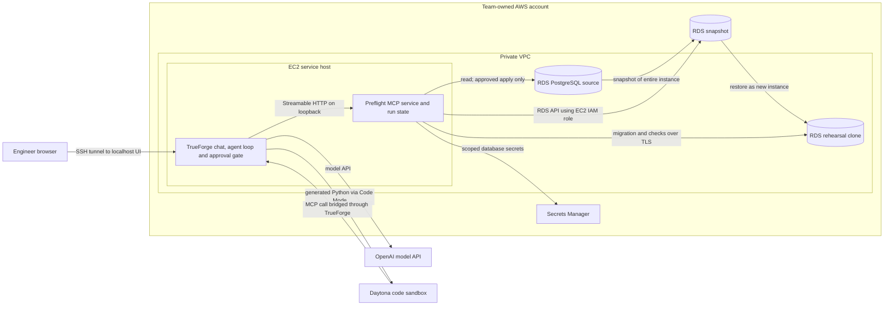

# Preflight: product requirements document

Version: 1.0  
Research checked: 25 September 2026  
Hackathon problem statement: **Migration Rehearsal Agent**, under **Agents That Act**

## 1. Product

Preflight rehearses a PostgreSQL migration against an isolated copy of the team's database. It records what the migration changed, checks the affected rows and schema, and gives the engineer evidence to review before the same migration can reach the source database.

The operator is an engineer preparing a database release. The buyer in a larger organization is the platform or database team responsible for release risk. The first supported job is one SQL migration against one owned Amazon RDS for PostgreSQL instance. This is deliberately narrower than a general database copilot: the product must produce a reproducible result and enforce a real approval pause.

The event asks for an agent that reaches a real system, executes generated code safely, and waits for human approval before an irreversible action. Its Migration Rehearsal Agent statement specifically asks for a restored database copy, schema change, row comparison, and report. Projects must use TrueForge and must be built during the hackathon; prior research is allowed. [Event brief][event]

### Outcome

An engineer can submit a migration, let Preflight create and test a database copy, inspect a report tied to the exact SQL bytes and snapshot, deny or approve the final apply tool, and verify that the source changed only after approval.

### Scope of this build

| Included                                                                    | Excluded from v1                                                                                        |
| --------------------------------------------------------------------------- | ------------------------------------------------------------------------------------------------------- |
| Owned RDS for PostgreSQL instance; one database and one migration at a time | MySQL, Aurora, multi-account fleets, automatic GitHub PR discovery                                      |
| RDS snapshot restored as a separate private RDS instance                    | RDS Blue/Green Deployments; these have PostgreSQL replication and DDL limitations [AWS][aws-blue-green] |
| TrueForge agent, Daytona code sandbox, OpenAI model, custom MCP tools       | A second chat app or dashboard                                                                          |
| Exact migration execution on the clone; deterministic checks; report        | AI-written production SQL or automatic data repair                                                      |
| Human gate before applying to the team's demo source                        | Access to a third party's production database                                                           |

The demo source contains synthetic data owned by the team. Any later use with customer data requires a separate security review. The RDS clone is the **database rehearsal sandbox**. Daytona is the **agent code sandbox**. They are different systems and serve different purposes. TrueForge's published sandbox documentation identifies Daytona as its supported sandbox provider and says MCP credentials remain in the harness while Code Mode scripts run separately. [TrueForge sandbox][tf-sandbox] [TrueForge Code Mode][tf-code]

The event lists TrueFoundry, Polaris School of Technology, OpenAI, AWS, and HackCulture as partners. TrueFoundry/TrueForge, OpenAI, and AWS each have a necessary product role here. Polaris is the co-host and venue partner, and HackCulture is the event partner; the brief does not publish a product API for either, so no artificial integration is specified. [Event brief][event]

## 2. Evidence and decisions

- PostgreSQL documents that many `ALTER TABLE` forms take an `ACCESS EXCLUSIVE` lock and that adding or validating constraints can scan a table. A migration that works on empty test data can behave differently on populated data. [PostgreSQL ALTER TABLE][pg-alter]
- A practitioner thread asks how to test migrations that seem quick to apply but produce trouble through a new trigger. This is a problem signal, not a measured market size. [r/PostgreSQL discussion][reddit-test]
- Amazon RDS snapshots copy an entire DB instance, not a single database. Restoring a snapshot creates a **new** instance; it cannot overwrite an existing instance. The clone must therefore get an explicit name, subnet group, security group, and deletion policy. [RDS snapshot restore][aws-restore]
- TrueForge `0.2.1` and its TypeScript SDK `0.2.0` were the latest published package versions returned by `pnpm view` during this research. The product must pin and test those versions instead of copying unverified APIs from the newer GitHub `main` branch. The pinned TrueForge source documents MCP tools, Code Mode, Daytona, approvals, local mode, and the bundled UI. [Pinned TrueForge release][tf-release]
- TrueForge's local mode has no login by default and is documented for private use only. This PRD runs it on a team-controlled EC2 instance reachable through an SSH tunnel for the demo. A shared enterprise deployment would use hosted mode with login. [TrueForge README][tf-readme]

## 3. User experience

1. The engineer supplies `migration.sql` and a validation contract. The agent shows the exact migration SHA-256, source RDS identifier, and planned checks before it starts.
2. Preflight creates an RDS snapshot and restores it to a new, private RDS instance tagged with the run ID. The UI shows `snapshotting`, `restoring`, and `ready` states; restore duration is not promised.
3. Preflight captures the baseline **on the restored clone before changing it**. This avoids comparing a fixed snapshot with a live source that may receive writes meanwhile.
4. The migration runner applies the exact submitted SQL to the clone inside one transaction. If it fails, the report records the PostgreSQL error and blocks apply. A failed transaction leaves the clone at its baseline state.
5. The validation engine compares the before and after schema and rows. OpenAI reads only the migration, schema metadata, counts, hashes, and errors. It explains the result and suggests additional checks; deterministic code computes the verdict.
6. A passing run produces a report with the source snapshot ID, clone ID, migration hash, before and after checks, elapsed time, known risks, and an apply plan. A `BLOCK` or incomplete `WARN` run has no enabled apply path.
7. On a `PASS`, the agent invokes the explicitly gated `apply_to_demo_source` tool. TrueForge stops and shows the tool name and arguments. Deny leaves the source unchanged and the run awaiting approval. Allow resumes the turn, and the MCP service rechecks the artifact hash and source state before applying the exact stored SQL.
8. The engineer can approve cleanup of the run-owned clone after the report is saved. Snapshot deletion is a separate explicit choice and is blocked after a source apply until an independent recovery backup is confirmed.

The agent must say **"rehearsal passed"**, never **"production is guaranteed safe"**. A clone does not reproduce live application traffic, lock contention, concurrent writes, or a later change in production data.

## 4. Architecture



The diagram has two controls that must remain separate: TrueForge approves an agent tool call, while the Preflight service validates whether that call is allowed for the run. The model and Daytona never receive an AWS key or database password.

| Link                             | Protocol and payload                                                                                              | Owner                    |
| -------------------------------- | ----------------------------------------------------------------------------------------------------------------- | ------------------------ |
| Engineer to TrueForge            | Browser to SSH-forwarded `localhost:8790`; chat inputs and approval decisions                                     | TrueForge UI             |
| TrueForge to OpenAI              | HTTPS model requests with migration text and redacted evidence                                                    | TrueForge model provider |
| TrueForge to Daytona             | Sandbox API; generated Python and non-sensitive tool results                                                      | TrueForge Code Mode      |
| Daytona to MCP                   | Code Mode `mcp_client.call_tool` bridged through TrueForge; no connector token in sandbox                         | TrueForge harness        |
| TrueForge to Preflight           | MCP Streamable HTTP at `http://127.0.0.1:8000/mcp`; typed tool calls and JSON results                             | Preflight MCP service    |
| Preflight to AWS control plane   | Boto3 RDS snapshot, restore, describe and tagged cleanup calls using the EC2 instance role                        | AWS RDS                  |
| Preflight to databases           | PostgreSQL over TLS; source read credential and write credential used on the clone or inside the gated demo apply | PostgreSQL               |
| Preflight to Secrets Manager     | `GetSecretValue` for named secrets only; values stay in the MCP process                                           | AWS Secrets Manager      |
| Preflight and TrueForge to state | Separate local SQLite stores for run state and agent sessions; no raw row data                                    | EC2 filesystem           |

An EC2 instance and RDS instances in the same VPC can communicate through security groups. The source and clone security groups must accept PostgreSQL traffic only from the EC2 service security group; the clone must not be public. EC2 receives AWS API credentials from an instance profile, with no static AWS keys in source code. [AWS RDS VPC pattern][aws-vpc] [EC2 IAM roles][aws-iam]

## 5. Component responsibilities

| Component               | Must do                                                                                                                       | Must not do                                                                    |
| ----------------------- | ----------------------------------------------------------------------------------------------------------------------------- | ------------------------------------------------------------------------------ |
| TrueForge agent         | Plan the run; call allowed tools; execute generated comparison code in Daytona; show evidence and approval                    | Hold DB credentials in prompts; infer a `PASS` against failed mandatory checks |
| OpenAI model            | Propose check types from the SQL; explain errors, row changes and limits in plain English                                     | Decide the numeric verdict or silently rewrite the migration                   |
| Preflight MCP service   | Own the run state machine, AWS calls, exact SQL bytes, database connections, deterministic validation, report and apply guard | Expose a general-purpose source SQL tool to the agent                          |
| Daytona sandbox         | Run agent-generated Python that chains typed MCP calls and formats evidence                                                   | Connect directly to RDS or receive AWS/DB secrets                              |
| RDS source              | Provide the owned database and snapshot; accept the approved demo apply                                                       | Accept pre-approval migration writes                                           |
| RDS clone               | Hold the restored data and receive migration rehearsal writes                                                                 | Serve application traffic or reach external integrations                       |
| Secrets Manager and IAM | Provide scoped credentials and AWS permissions                                                                                | Supply credentials to the model or sandbox                                     |

The MCP server uses the official Python MCP SDK's Streamable HTTP transport, Boto3 for RDS, and Psycopg for PostgreSQL. These dependencies each solve a required integration; the project does not need a separate frontend or generic agent framework. The official SDK documents a Streamable HTTP server and client. [MCP Python SDK][mcp-python]

## 6. Inputs, artifacts and state

### Required inputs

- `source_instance_id`: allowlisted RDS identifier in the team's AWS account.
- `database_name`: one PostgreSQL database on that instance.
- `migration.sql`: UTF-8 SQL file. Store its exact bytes and SHA-256 before execution. The MVP accepts only top-level `ALTER TABLE` and `UPDATE` statements on declared tables, all runnable in one transaction. Reject transaction control, `psql` backslash commands and any other statement type.
- `contract.json`: tables and columns that must be preserved, plus checks for intended changes. Missing expectations for a touched table make the result `WARN`, not `PASS`.
- `operator_id`: person using the private demo UI; include it in the report. In v1 this is a human-entered label, not enterprise identity proof.

Example `contract.json` for the demo:

```json
{
  "database": "preflight_demo",
  "tables": [
    {
      "name": "public.customers",
      "primary_key": ["id"],
      "preserve_columns": ["id", "email", "created_at"],
      "checks": [
        { "type": "row_count_unchanged" },
        { "type": "no_nulls", "column": "account_tier" },
        { "type": "all_equal", "column": "account_tier", "value": "standard" }
      ]
    }
  ],
  "max_migration_seconds": 60,
  "max_rows_per_table": 10000
}
```

The contract is a Preflight product format, not a TrueForge or AWS API. The service validates table and column identifiers against database metadata, validates check types, and rejects arbitrary SQL in this file. `max_migration_seconds` and `max_rows_per_table` are explicit operator limits; exceeding either blocks a `PASS`, and the timeout is not a claim that a production migration will finish within a minute.

### Run record

Persist one row per run in Preflight's SQLite store with `run_id`, operator, source and clone IDs, snapshot ID, current candidate version, source and clone schema fingerprints, source preserved-data fingerprint, timestamps, state, error code, and approved tool call result. Persist each candidate's migration SHA-256, contract SHA-256 and report SHA-256 separately. Store no database rows or passwords. Write immutable `reports/<run_id>/<candidate_id>.json` and `.md` files with only aggregate evidence; hash the canonical, sorted-key JSON bytes and keep old candidate reports after a revision. TrueForge separately retains its own session and tool trace.

### States

```mermaid
stateDiagram-v2
  [*] --> REGISTERED
  REGISTERED --> SNAPSHOTTING
  SNAPSHOTTING --> RESTORING
  RESTORING --> READY: clone available
  READY --> BASELINED: baseline captured
  BASELINED --> MIGRATING
  MIGRATING --> VALIDATING: SQL committed on clone
  MIGRATING --> BLOCKED: SQL failed and rolled back
  VALIDATING --> PASS: all required checks passed
  VALIDATING --> WARN: coverage or measurement incomplete
  VALIDATING --> BLOCKED: required check failed
  BLOCKED --> BASELINED: revised candidate; clone still at baseline
  PASS --> AWAITING_APPROVAL
  AWAITING_APPROVAL --> APPLYING: human allows
  AWAITING_APPROVAL --> AWAITING_APPROVAL: human denies; no tool execution
  APPLYING --> APPLIED: exact SQL committed on demo source
  APPLYING --> APPLY_FAILED: transaction failed and rolled back
  APPLYING --> APPLIED_NEEDS_ATTENTION: committed; post-commit check failed
  SNAPSHOTTING --> ERROR
  RESTORING --> ERROR
  READY --> ERROR
  BASELINED --> ERROR
  WARN --> [*]
  APPLIED --> [*]
  APPLY_FAILED --> [*]
  APPLIED_NEEDS_ATTENTION --> [*]
  ERROR --> [*]
```

Each AWS operation is asynchronous. `start_rehearsal` returns a run ID promptly; `get_run` reports progress. On a service restart, the worker checks the persisted run and RDS tags before resuming or marking it `ERROR`. Only one active rehearsal is allowed in the hackathon build. Retrying a failed candidate on the same clone is allowed only when its transaction rolled back and the clone schema fingerprint still equals the baseline; otherwise create a fresh clone.

## 7. MCP tool contract

The custom server exposes these named tools. Every tool validates `run_id` and the state before doing work. It returns JSON with `run_id`, `state`, `ok`, `error_code` where relevant, and a compact result. No tool returns raw table rows.

| Tool                   | Input                                                        | Effect and output                                                                                                                                                            | Approval                       |
| ---------------------- | ------------------------------------------------------------ | ---------------------------------------------------------------------------------------------------------------------------------------------------------------------------- | ------------------------------ |
| `register_candidate`   | Exact SQL text, contract JSON, operator ID                   | Validate sizes and contract; persist exact SQL; return candidate ID and SHA-256                                                                                              | No                             |
| `start_rehearsal`      | Candidate ID, allowlisted source instance ID, database name  | Start snapshot and clone job; return run ID and state                                                                                                                        | No                             |
| `get_run`              | Run ID                                                       | Return state, progress, resource IDs, errors                                                                                                                                 | No                             |
| `get_source_status`    | Allowlisted source ID, database name, contract table names   | Read-only schema summary and fingerprints for the declared objects; no raw rows                                                                                              | No                             |
| `capture_baseline`     | Run ID                                                       | On clone, record schema, counts and row hashes for declared tables                                                                                                           | No                             |
| `apply_to_clone`       | Run ID, candidate ID                                         | Execute stored SQL on clone in one transaction; return duration and PostgreSQL error if any                                                                                  | No; clone is disposable        |
| `validate_rehearsal`   | Run ID                                                       | Run required typed checks; return before/after aggregates and PASS/WARN/BLOCK                                                                                                | No                             |
| `get_report`           | Run ID, optional candidate ID                                | Return that candidate's report JSON/Markdown, hashes and evidence; default to current candidate                                                                              | No                             |
| `apply_to_demo_source` | Run ID, candidate ID, migration hash, report hash, source ID | Recheck PASS, hashes, source schema and preserved data, and backup; execute exact stored SQL on owned demo source                                                            | **Yes, literal tool approval** |
| `cleanup_run`          | Run ID, resource IDs                                         | Delete only resources tagged with this run ID after checking IDs and report retention; block snapshot deletion after source apply until another recovery backup is confirmed | **Yes, literal tool approval** |

In the saved TrueForge agent, enable the Preflight MCP server and set `require_approval_for_tools` to the literal names `apply_to_demo_source` and `cleanup_run`. Do not rely on `@destructive` alone: TrueForge's own docs warn that annotation-based selectors cannot gate tools whose MCP annotations are absent or wrong. Approvals apply to Code Mode calls too. [TrueForge agent config][tf-agent] [TrueForge Code Mode][tf-code]

The server also rejects an apply call unless the target is the single allowlisted demo source, the report is `PASS`, hashes match the stored artifact, the clone run completed, a current backup is available, and the current source schema **and preserved-data** fingerprints match the values recorded at rehearsal. This intentionally blocks a source that changed after the snapshot in the static demo; a later production version needs a drift-aware recheck. Approval is the final user action shown by TrueForge; these checks are the service's defense against a stale or edited request. TrueForge's denied call never reaches the service, so denial is visible in its session trace while the service remains `AWAITING_APPROVAL`. A later production version also needs authenticated approver identity and server-verifiable authorization, not only a private chat UI.

## 8. Rehearsal and validation algorithm

1. **Register.** Validate the submitted SQL file size, UTF-8 encoding, allowed database and contract. Parse the SQL with `pglast` matched to the target PostgreSQL major version; accept only the stated top-level statement types targeting contract tables, and reject any explicit transaction command. This parser check is required because text splitting and keyword matching cannot reliably enforce an atomic script. Compute hashes. Never let the model substitute revised SQL without registering it as a new candidate version. [pglast][pglast]
2. **Snapshot.** Call `CreateDBSnapshot` on the allowlisted source. Wait until the snapshot is `available`. RDS snapshots cover the entire instance, so the hackathon source must contain only team-owned synthetic data. [RDS snapshot docs][aws-snapshot]
3. **Restore.** Call `RestoreDBInstanceFromDBSnapshot` with a new `preflight-<run_id>` instance identifier, explicit private DB subnet group, explicit restricted security group, no public access, and tags for owner, run ID and expiry. Wait until `available`; verify the clone's engine version and network route. AWS does not restore a snapshot into the existing source instance. [RDS restore docs][aws-restore]
4. **Capture baseline.** Query the clone for schema metadata, row counts and deterministic per-row SHA-256 hashes over the contract's preserved columns, ordered by primary key. Stream rows through the MCP process; persist only aggregate counts and hash results. Query the source using its read credential and require its preserved-data fingerprint and schema to equal the clone baseline. This works for the static synthetic demo source; if source writes occur during snapshot/restore, stop with `WARN` and rerun from a fresh snapshot. Missing primary keys or inaccessible tables also produce `WARN` and require a revised contract.
5. **Inspect migration.** OpenAI proposes relevant typed checks and notes lock or data risks. The engineer's contract defines required checks. The model's suggestions do not silently change acceptance rules.
6. **Apply to clone.** Execute the exact stored SQL text via Psycopg on a clone-only connection configured with `autocommit=True`; use `Connection.transaction()` around `cursor.execute(sql_text, prepare=False)` with no query parameters. Set a validated statement timeout and a short lock timeout inside that transaction. Catch the database exception, roll back, and record duration and post-failure schema fingerprint. Expose only SQLSTATE and a service-generated safe error summary; PostgreSQL `DETAIL` or SQL text may contain row values and must not reach logs or the model. Psycopg documents both multi-statement execution without bound parameters and transaction contexts. The parser rejects `psql` client commands and any SQL outside the supported subset, including `CREATE INDEX CONCURRENTLY`. [Psycopg statements][psycopg-statements] [Psycopg transactions][psycopg-transactions] [PostgreSQL CREATE INDEX][pg-index]
7. **Compare.** Recompute schema and row evidence on the clone. For each preserved table, compare primary-key sets and per-row hashes for preserved columns. Serialize supported values in a type-tagged canonical form before hashing; for v1, support the demo's integer, text and `timestamptz` types, converting timestamps to UTC. An unsupported type yields `WARN`, not a silently unstable hash. Execute typed checks for intended new columns, counts, nulls and uniqueness. Mark each check `pass`, `fail`, or `not_run`; never turn `not_run` into a pass. A transaction failure or required failed check yields `BLOCK`. Missing required evidence yields `WARN`. Only complete passing evidence yields `PASS`.
8. **Report.** OpenAI explains the deterministic results and proposes a revised migration or manual investigation when blocked. The service writes a machine-readable report plus concise Markdown. Any risk it cannot measure is stated plainly.
9. **Apply gate.** For the team's demo source only, show the report, exact source ID, migration hash and backup status. TrueForge pauses at `apply_to_demo_source`. On approval, the service checks all artifact hashes plus source schema and preserved-data fingerprints again, then runs the stored file and required source checks in one transaction. Failure before commit rolls back and becomes `APPLY_FAILED`. After commit, perform a read-only confirmation and record `APPLIED`; if confirmation cannot complete, record `APPLIED_NEEDS_ATTENTION` and **never** retry the SQL automatically. On denial TrueForge does not call the service, so no write connection opens; a later explicit request can ask again. Reject a repeated apply after a committed source write, even if TrueForge retries the tool call.

For row evidence, encode each supported value as a typed JSON pair (`null`, integer, UTF-8 text, or UTC timestamp with microseconds), serialize without insignificant whitespace, and SHA-256 the primary-key tuple plus preserved-column tuple. Compare rows in primary-key order; report counts of missing keys and changed hashes, not keys or values. Build schema fingerprints from sorted metadata for the declared tables: columns, types, nullability, defaults, constraints and indexes. A table exceeding the configured full-scan budget is `WARN`; sampling cannot produce `PASS`.

`pg_dump` is an alternative for moving a single PostgreSQL database, but this design uses an RDS snapshot because it gives the agent a real AWS restore operation. PostgreSQL states that `pg_dump` exports a consistent single database while RDS snapshots cover an entire instance. Do not describe one as the other. [PostgreSQL pg_dump][pg-dump] [RDS restore docs][aws-restore]

### Report schema

```json
{
  "run_id": "string",
  "status": "PASS | WARN | BLOCK",
  "source_instance_id": "string",
  "snapshot_id": "string",
  "clone_instance_id": "string",
  "migration_sha256": "64-character hex string",
  "contract_sha256": "64-character hex string",
  "source_schema_fingerprint": "string",
  "source_preserved_data_fingerprint": "string",
  "checks": [
    {
      "name": "string",
      "status": "pass | fail | not_run",
      "before": "value",
      "after": "value"
    }
  ],
  "migration_duration_ms": 0,
  "errors": [],
  "risks_not_tested": [],
  "backup_status": "available | pending | failed",
  "apply_eligible": false
}
```

The example shows field shapes, not a real run. A report is immutable after hashing. A new candidate creates a new report and invalidates earlier approval eligibility without deleting the prior report. A `PASS` requires no errors, every declared mandatory check passing, and a completed backup and clone record. `apply_eligible` describes the report-time result only; the service must freshly recheck source schema and preserved data when the apply tool runs.

## 9. Safety and limits

- The MCP server uses two database secrets: a source read credential and a migration write credential whose role is present in the restored clone. It fetches the write secret for clone execution but only permits that credential to connect to the allowlisted source inside the gated `apply_to_demo_source` path after all guards pass. Neither value appears in tool output, model context, Daytona, logs, report files, or Git.
- The EC2 IAM role needs RDS actions to create/describe snapshots, restore/describe instances, add/list resource tags, and delete only tagged run-owned clone instances and snapshots; it also needs `secretsmanager:GetSecretValue` on the named DB secrets. Scope actions to known ARNs and conditions where AWS supports them, and independently enforce source allowlists and run tags in the service. Do not grant an unrestricted RDS delete path.
- The clone uses an explicit private security group and receives no application traffic. Restored databases may still contain roles, functions and credentials from the source; the demo uses synthetic data and the clone has no outbound application integrations.
- TrueForge local mode stays behind an SSH tunnel. No public TrueForge or MCP port is opened. For a shared deployment, use TrueForge hosted mode and identity controls. [TrueForge README][tf-readme]
- In the hackathon build, TrueForge's UI is the human approval boundary; the MCP server does not receive cryptographic proof that a tool call was approved. Its loopback-only endpoint and source allowlist make this suitable for a controlled demo, **not** an enterprise production apply. Production enablement requires a server-verifiable, single-use approval bound to an authenticated approver, report hash, migration hash, target and expiry.
- One transaction makes a **failed** supported migration atomic on the clone. A **successful** data migration is not automatically reversible. A backup restore creates another RDS instance and may require traffic cutover; it is not an instant SQL undo. [RDS point-in-time restore][aws-pit]
- Source apply is also transactional for the supported SQL subset. If the post-commit verification fails, the service must report uncertainty and the engineer must inspect the source manually. It must not call this a rollback or attempt the same migration again.
- The clone does not reproduce production concurrency or traffic. Report measured runtime and lock-prone SQL, but label production downtime and performance as unproven. PostgreSQL's documented table locks explain why this distinction matters. Snapshot creation and restore are also asynchronous infrastructure operations, not a quick per-request database copy. [PostgreSQL ALTER TABLE][pg-alter] [RDS snapshot docs][aws-snapshot]
- If AWS snapshot or restore fails, the database is unreachable, a check times out, the model is unavailable, or the service restarts mid-run, the report cannot be `PASS`. Existing tagged resources remain visible for deliberate cleanup.
- Deleting a clone or snapshot is irreversible. `cleanup_run` has its own TrueForge approval and can target only IDs and tags belonging to the run. Keep the pre-apply snapshot after any source apply unless an independent recovery backup is confirmed; after cleanup, keep the report and operation log.

## 10. Build specification for coding agents

Use one Python service and TrueForge's bundled UI. Do not build a second web app. Keep the Python modules small enough to test independently.

```text
preflight/
  pyproject.toml
  src/preflight/server.py          # MCP tool definitions and input validation
  src/preflight/jobs.py            # run state machine and async worker
  src/preflight/aws_rds.py         # snapshot, restore, describe, tagged cleanup
  src/preflight/db.py              # scoped PostgreSQL connections and SQL runner
  src/preflight/sql_policy.py      # PostgreSQL AST validation for supported SQL
  src/preflight/evidence.py        # schema, counts, row hashes, typed checks
  src/preflight/report.py          # verdict, JSON and Markdown report
  src/preflight/storage.py         # SQLite run and artifact records
  src/preflight/security.py        # allowlists, hashes, target and state guards
  fixtures/seed_demo.py            # synthetic customers table
  fixtures/bad.sql                 # NOT NULL column on populated table
  fixtures/good.sql                # add, backfill, then set NOT NULL
  fixtures/contract.json
  tests/test_verdict.py
  tests/test_artifact_guards.py
  tests/test_sql_policy.py
  tests/test_row_comparison.py
  tests/test_mcp_flow.py
  README.md                        # setup plus required AI-assistant disclosure
```

The required runtime Python packages are the official `mcp` SDK for the tool server, `boto3` for AWS, `psycopg` for PostgreSQL, and `pglast` for PostgreSQL-aware SQL parsing. The parser is a deliberate dependency: implementing safe transaction and statement-type checks with regex would be unsound. Use the standard library for JSON, hashing, SQLite and background jobs. Pin dependency versions after the first working integration. For TrueForge use the published `@truefoundry/trueforge@0.2.1` package through `pnpm dlx`; it requires Node.js 22.14 or newer in its package metadata. Configure its OpenAI model provider, Daytona sandbox provider and the local Preflight MCP connector in the built-in UI. Use an OpenAI model actually available to the team account rather than assuming credits imply access to a particular model. [TrueForge release][tf-release] [TrueForge models][tf-models]

Create a saved TrueForge agent named `preflight` with sandbox enabled, only the named Preflight MCP tools exposed, dynamic subagents disabled for the one-run MVP, and literal approval on `apply_to_demo_source` and `cleanup_run`. Its instructions must require: exact artifact hashes; baseline before migration; deterministic check results as the source of truth; no raw rows in responses; no production apply on `WARN` or `BLOCK`; a written report before requesting approval; and explicit disclosure of untested risks. The pinned TrueForge agent spec supports model, instructions, MCP servers and sandbox configuration. [TrueForge agent config][tf-agent]

The saved agent's relevant manifest fields are:

```json
{
  "model": { "name": "openai/<configured-model-id>" },
  "mcp_servers": [
    {
      "name": "preflight",
      "enable_tools": [
        "register_candidate",
        "start_rehearsal",
        "get_run",
        "get_source_status",
        "capture_baseline",
        "apply_to_clone",
        "validate_rehearsal",
        "get_report",
        "apply_to_demo_source",
        "cleanup_run"
      ],
      "require_approval_for_tools": ["apply_to_demo_source", "cleanup_run"]
    }
  ],
  "config": {
    "sandbox": { "enabled": true },
    "dynamic_sub_agents": { "enabled": false }
  }
}
```

Replace the model placeholder with the account's configured OpenAI model; include the instructions described above. The connector named `preflight` must already point to the local MCP URL in TrueForge **Settings → Connectors**. [TrueForge MCP setup][tf-mcp]

### Build order

1. Provision the team's RDS PostgreSQL demo source and one EC2 service host in the same VPC. Seed the synthetic fixture. Create the EC2 instance profile, clone security group, DB credentials in Secrets Manager, and snapshot/restore permissions.
2. Implement the Preflight run store, source allowlist, artifact hashing, snapshot/restore job and `get_run`. Verify a fresh clone is private and separate from the source.
3. Implement baseline, transactional migration runner, row comparison and deterministic verdict. Test `bad.sql` and `good.sql` directly against a disposable PostgreSQL database before involving the agent.
4. Wrap those operations as MCP tools and test them with an MCP client. Start TrueForge `0.2.1`, connect the MCP server, OpenAI and Daytona, and save the `preflight` agent.
5. Exercise Code Mode, denial, approval, report export, error path and cleanup in the real TrueForge UI. Finish the project README with architecture, setup, commands run and the AI assistants used, as the event rules require. [Event brief][event]

### Configuration required from the team

The coding agents must receive the team's AWS account and region, the demo RDS instance identifier and database name, VPC/subnet/security-group IDs, named Secrets Manager secret ARNs, an OpenAI API key with an available model, and a Daytona key with sandbox and snapshot permissions. Store these in the team's secret manager or runtime environment. The PRD intentionally contains no invented account IDs, credentials, region, cost estimate, or promise that sponsor credits have already been issued. Daytona's snapshot-write requirement comes from TrueForge's published setup guide. [TrueForge sandbox][tf-sandbox]

## 11. Demo script

The demo uses a team-owned `customers` table with 1,000 synthetic rows. Show the RDS source identifier before the run. These fixtures are created during the hackathon, consistent with the event's build rule. Start the snapshot/restore job early enough that its RDS clone is `available` when the judges arrive; retain the TrueForge session trace and AWS resource IDs that prove the agent created it. Do not claim the restore completed live if it was started earlier.

The exact fixture migrations are:

```sql
-- bad.sql
ALTER TABLE public.customers ADD COLUMN account_tier text NOT NULL;
```

```sql
-- good.sql
ALTER TABLE public.customers ADD COLUMN account_tier text;
UPDATE public.customers SET account_tier = 'standard' WHERE account_tier IS NULL;
ALTER TABLE public.customers ALTER COLUMN account_tier SET NOT NULL;
```

| Beat                     | Action                                                                                               | Judge-visible result                                                                                                                                             |
| ------------------------ | ---------------------------------------------------------------------------------------------------- | ---------------------------------------------------------------------------------------------------------------------------------------------------------------- |
| 1. Real connection       | Ask Preflight to rehearse `bad.sql`: `ALTER TABLE customers ADD COLUMN account_tier text NOT NULL;`  | Agent shows source, snapshot, clone, migration hash and live MCP status.                                                                                         |
| 2. Catch the failure     | Run the migration on the populated clone.                                                            | PostgreSQL rejects it; report is `BLOCK`, source schema unchanged, no apply gate appears.                                                                        |
| 3. Correct the candidate | Register `good.sql`: add nullable column, backfill existing rows to `standard`, then set `NOT NULL`. | New candidate hash; same clone may be reused only after verifying the failed transaction left baseline unchanged.                                                |
| 4. Prove the result      | Run good candidate and validation.                                                                   | `PASS`: 1,000 rows before and after, preserved `id/email/created_at` hashes match, zero `account_tier` nulls, constraint present, elapsed time and limits shown. |
| 5. Show control          | Trigger `apply_to_demo_source`, first deny in one session, then request again and allow.             | Denial leaves source unchanged; TrueForge displays an approval pause; approval applies exact stored SQL to the owned demo source after rechecks.                 |
| 6. Verify                | Query source schema through the read tool and show the report plus TrueForge tool trace.             | Source has `account_tier` only after approval; report identifies snapshot, clone and SQL hash.                                                                   |

The judge can see one bad migration stopped, a corrected migration proved against rows, and a real write blocked until approval. The fallback if snapshot restoration is still pending is to show the persisted RDS state and prior agent trace, then run the migration and validation live once the clone is ready. Do not use a fake database response.

## 12. Acceptance criteria

The project is ready to submit only when the following have been observed, not just implemented:

1. TrueForge `0.2.1` runs the saved Preflight agent with an OpenAI model, a Daytona sandbox, and the custom MCP connector. The session trace shows a real sandbox execution and real MCP calls.
2. The agent creates an RDS snapshot and a separate, private RDS clone in the team's AWS account. The clone's source snapshot ID and run tags match the report. The source remains unchanged during rehearsal.
3. `bad.sql` fails on the clone, returns `BLOCK`, and cannot call the apply path. `good.sql` returns `PASS` with row counts, primary-key comparison, preserved-column hashes, new-column checks and a migration duration.
4. An approval denial makes no source change. An approval allowance causes exactly one source apply of the stored hash. A repeated call or stale hash is rejected by the MCP service.
5. An injected bad resource ID or altered report hash cannot apply. A missing mandatory check or inaccessible database during rehearsal cannot produce `PASS`; source schema or preserved-data drift after rehearsal blocks apply even if the earlier report remains `PASS`.
6. No database password, AWS key or raw customer row appears in the Git repository, TrueForge session, Daytona output, MCP JSON, report or demo recording. The demo uses synthetic rows.
7. The README discloses AI assistants used. The final live check inspects the report, AWS resource list, source schema and cleanup state. Record exact test commands and their results in the README.

For this build, use focused tests of verdict classification, row hashing, state transitions, artifact replay guards, and an integration test against disposable PostgreSQL. Finish with one end-to-end run in the real TrueForge UI and AWS account. A passing unit suite alone does not prove the event requirement.

## Sources

[event]: https://hackculture.io/hackathons/agents-that-act
[tf-release]: https://github.com/truefoundry/trueforge/tree/de68a1643f4aafbefc80c6cbfe4bfda361459b29
[tf-readme]: https://github.com/truefoundry/trueforge/blob/de68a1643f4aafbefc80c6cbfe4bfda361459b29/README.md
[tf-sandbox]: https://github.com/truefoundry/trueforge/blob/de68a1643f4aafbefc80c6cbfe4bfda361459b29/docs/sandbox.mdx
[tf-code]: https://github.com/truefoundry/trueforge/blob/de68a1643f4aafbefc80c6cbfe4bfda361459b29/docs/key-features/code-mode.mdx
[tf-agent]: https://github.com/truefoundry/trueforge/blob/de68a1643f4aafbefc80c6cbfe4bfda361459b29/docs/create-agent/overview.mdx
[tf-models]: https://github.com/truefoundry/trueforge/blob/de68a1643f4aafbefc80c6cbfe4bfda361459b29/docs/models.mdx
[tf-mcp]: https://github.com/truefoundry/trueforge/blob/de68a1643f4aafbefc80c6cbfe4bfda361459b29/docs/mcp-servers.mdx
[aws-restore]: https://docs.aws.amazon.com/AmazonRDS/latest/UserGuide/USER_RestoreFromSnapshot.html
[aws-snapshot]: https://docs.aws.amazon.com/AmazonRDS/latest/UserGuide/USER_CreateSnapshot.html
[aws-vpc]: https://docs.aws.amazon.com/AmazonRDS/latest/UserGuide/USER_VPC.Scenarios.html
[aws-iam]: https://docs.aws.amazon.com/AWSEC2/latest/UserGuide/iam-roles-for-amazon-ec2.html
[aws-pit]: https://docs.aws.amazon.com/AmazonRDS/latest/UserGuide/USER_PIT.html
[aws-blue-green]: https://docs.aws.amazon.com/AmazonRDS/latest/UserGuide/blue-green-deployments-considerations.html
[pg-alter]: https://www.postgresql.org/docs/current/sql-altertable.html
[pg-index]: https://www.postgresql.org/docs/current/sql-createindex.html
[pg-dump]: https://www.postgresql.org/docs/current/app-pgdump.html
[mcp-python]: https://github.com/modelcontextprotocol/python-sdk
[pglast]: https://github.com/lelit/pglast
[psycopg-statements]: https://www.psycopg.org/psycopg3/docs/basic/from_pg2.html#multiple-results-returned-from-multiple-statements
[psycopg-transactions]: https://www.psycopg.org/psycopg3/docs/basic/transactions.html#transaction-contexts
[reddit-test]: https://www.reddit.com/r/PostgreSQL/comments/16e7xwx/how_do_you_test_migrations_to_ensure_that_they/
